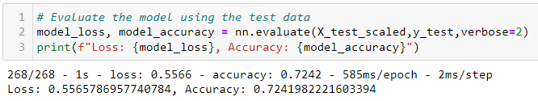
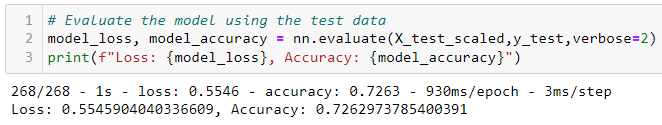
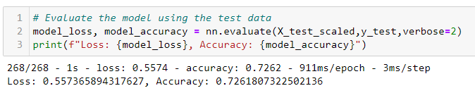
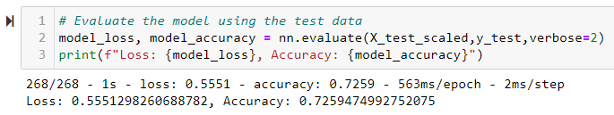

# Neural_Network_Charity_Analysis
Neural Networks and Deep Learning Models

## Overview of the Analysis
### Purpose

Alphabet Soup is a nonprofit that invests in life saving technologies and reforestation around the world. They have requested that a machine learning model be created to predicting whether their investment applicants will be successful if Alphabet Soup choses to fund them. The purpose of this analysis was to make a neural network that could be used to create a binary classifier that can make these predictions.  The data set given was of 34,000 groups that used Alphabets soup funding successfully.

### Resources
* TensorFlow
* Python     
* Jupyter Notebook
* Pandas
* Scikit-learn
* Data Source:     

## Results

### Data Preprocessing  

* The target variable in this model is the `IS_SUCCESSFUL` column, since the model is trying to predict if the applicant organization will be successful with funds that they would receive. 

* There are two columns of data that are identification information; `EIN` and the `Name` columns. This data will not add to our analysis and may add additional noise to the model, therefore they were removed.

* The remaining columns of data, aside from the three listed above, are all features of the created model. These Variables are `APPLICATION_TYPE`, `AFFILIATION`, `CLASSIFICATION`, `USE_CASE`, `ORGANIZATION`, `STATUS`, `INCOME_AMT`, `SPECIAL_CONSIDERATIONS`, `ASK_AMT`.

### Compiling, Training, and Evaluating the Model 

 #### Initial Model
* The original neural network model was created with two hidden relu layers, the first with 80 neurons, and the second with 30 neurons. This model had an sigmoid output layer for binary classification. After running the model, an accuracy of 72.42% was produced. The goal was to get this accuracy score to reach at least 75%.

#### Optimization 1
* In the first attempt for optimization, the activation algorithm for the two hidden layers were changed to tanh instead of relu Loss . After changing the activation, the model produced and accuracy of 72.63%. A very slight increase was seen; however it is not enough to make the difference Alphabet Soup is looking for.
 

#### Optimization 2
* On the second attempt for optimization, the activation algorithm for the first two hidden layers was the same as the original model. Additionally, a third hidden layer was added. The third layer used a tanh activation and had 15 neurons. With the addition of the third layer, the model ran with a 72.59% accuracy. 
 

#### Optimization 3
* In the first attempt for optimization, the activation algorithm for the two hidden layers were changed to tanh instead of relu Loss . After changing the activation, the model produced and accuracy of 72.63%. A very slight increase was seen; however it is not enough to make the difference Alphabet Soup is looking for.
 

## Summary

Through these four models that were created, none of them succeeded in reaching an accuracy score of 75%. Changing the activation algorithms, increasing the number of hidden layers, and adjusting the number of neurons on those layers did not help improve the model created. 

The first optimization model that used tanh instead of relu activation performed the best.  The accuracy was 72.63% where the initial model produced 72.42%.  The model only increased accuracy by 0.21%. 

It may be recommended to try a supervised machine learning model instead. A random forest could be used since we are dealing with binary data. 
